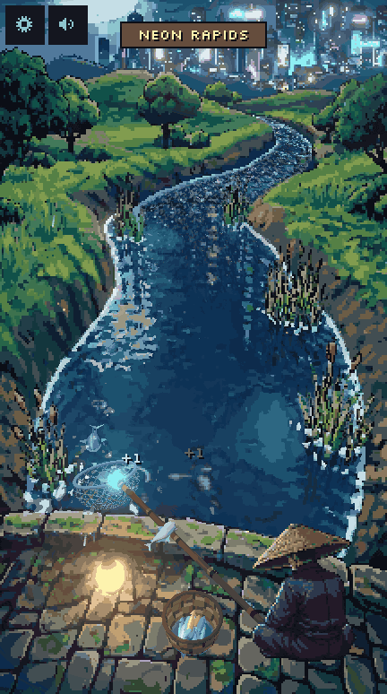
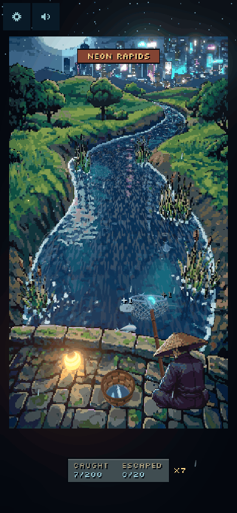
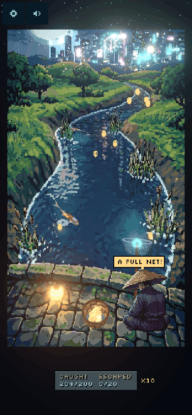
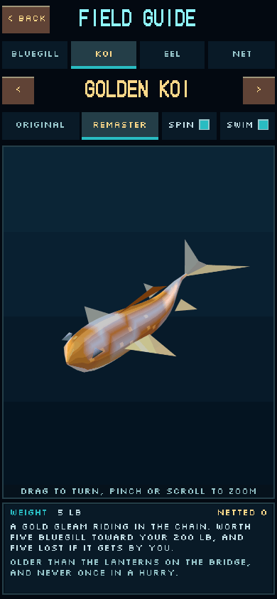
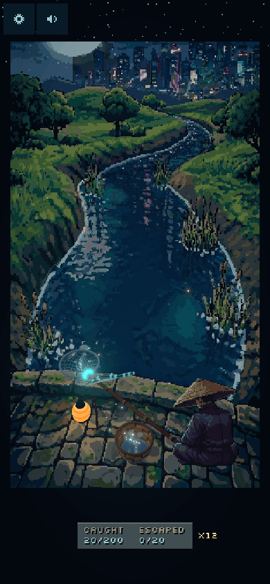
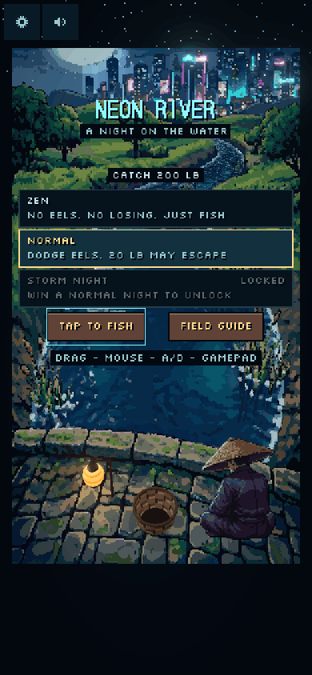
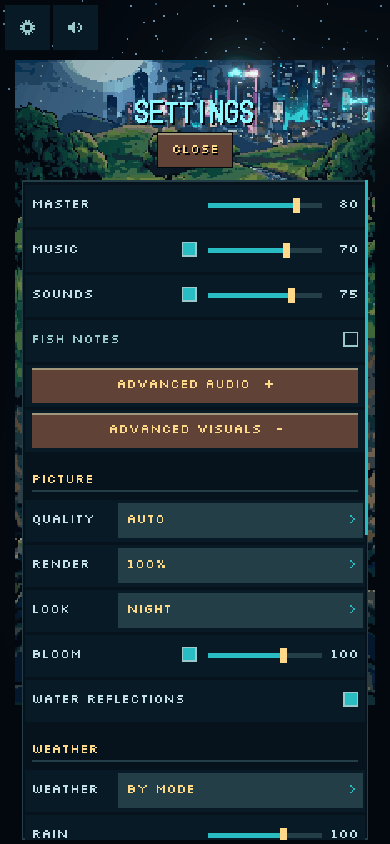
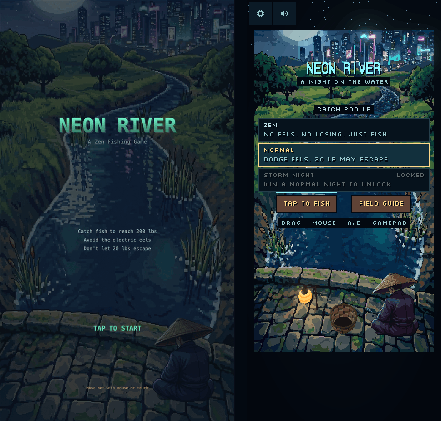

<p align="center">
  <a href="https://neonriver2.kahdev.me">
    
  </a>
</p>

<h1 align="center">Neon River</h1>

<p align="center">
  A night-fishing arcade game: a pixel-art painting brought to life in 3D.<br />
  <strong><a href="https://neonriver2.kahdev.me">Play now → neonriver2.kahdev.me</a></strong>
</p>

|                                               On a phone                                                |                                              The win                                              |                                                         Field Guide                                                         |
| :-----------------------------------------------------------------------------------------------------: | :-----------------------------------------------------------------------------------------------: | :-------------------------------------------------------------------------------------------------------------------------: |
|  |  |  |
|                                              **Eel shock**                                              |                                             **Modes**                                             |                                                     **Visual settings**                                                     |
|   |        |          |

Catch **200 lb** of fish. Let no more than **20 lb** escape. Never net an **electric eel**.

It runs in the browser on phones (portrait) and desktops, with nothing to install.

## Modes

| Mode            | Rules                                                                                                                                                    |
| --------------- | -------------------------------------------------------------------------------------------------------------------------------------------------------- |
| **Zen**         | No eels and no losing. 200 lb still plays the win, then you can keep fishing for as long as you like.                                                    |
| **Normal**      | Dodge the eels; 20 lb may escape. Four stages, three speed-ups, and rain that builds as the night goes on. A good night takes about two minutes.         |
| **Storm Night** | Unlocked by winning a Normal night. Starts at Normal's first speed-up pace, has five stages, half again as many eels, a 15-lb limit, rain and lightning. |

| Fish         | Weight | Notes                                                  |
| ------------ | ------ | ------------------------------------------------------ |
| Bluegill     | 1 lb   | The everyday catch                                     |
| Golden Koi   | 5 lb   | Rare. Worth five bluegill, and five lost if it gets by |
| Electric Eel | none   | Ends the night if it touches the net                   |

## Controls

| Input    | Move the net                                                 | Pause           |
| -------- | ------------------------------------------------------------ | --------------- |
| Mouse    | Move the pointer                                             | Space, Esc or P |
| Keyboard | A / D or ← / →                                               | Space, Esc or P |
| Touch    | Drag anywhere (relative, so your thumb never covers the net) | The gear button |
| Gamepad  | Left stick or D-pad                                          | Start           |

## Features

- **The painting, in 3D.** The original pixel-art night is the world, split into depth layers. The water, fish,
  eels, net, lantern and basket are toon-lit 3D objects living inside it, lit by its moon, lantern and neon.
- **Fish patterns in the spirit of the Jak and Daxter fishing minigame.** Every fish comes from one emitter that sweeps across the
  river, so fish arrive in readable lines and S-shaped runs instead of at random. Each speed-up brings a run.
- **Fair eels.** Every eel is announced before it appears, and the spawner never asks you to be in two places at once.
- **Field Guide.** Each fish and the net on a 3D turntable, with the original v1 sprite beside the remaster and your lifetime catches.
- **Sound.** A calm koto-and-synth loop, river ambience, rain and thunder, and optional notes that play a melody as you catch.
  Advanced audio settings give every channel its own fader and switch.
- **Advanced visuals.** Quality (Auto / Low / Medium / High), render scale, four looks (Night, Vivid Neon, Ukiyo-e, Moonlight),
  bloom, reflections, weather, particles, camera drift, screen shake, reduce motion, reduce flashing, HUD size.
- **Records.** Best time, best streak and wins per mode, kept in your browser.
- **Installable.** Add it to a phone's home screen and it opens fullscreen in portrait.

## Remastered from Neon River (v1)



_Left: v1. Right: the remaster._

The first Neon River was a Canvas 2D game: the same painting, flat sprites, random spawns.

- v1 repository: [khesse-757/neon-river](https://github.com/khesse-757/neon-river)
- v1, still playable: [neonriver.kahdev.me](https://neonriver.kahdev.me)

The remaster keeps the painting, the fisherman, the rules and the catch sound. Everything else is new: a three.js
renderer, 3D actors and water, a deterministic simulation with scripted stages, three modes, generated audio and
the Field Guide. [`docs/devlog.md`](docs/devlog.md) tells the story, dead ends included.

## Tech stack

- [three.js](https://threejs.org) (WebGL), TypeScript (strict), [Vite](https://vite.dev)
- Vitest for the simulation, audio and records; Playwright for the browser tests
- Web Audio, with sound generated offline and committed as files
- GitHub Actions for CI and for the deploy to GitHub Pages

No backend, no accounts, no analytics. Settings and records stay in `localStorage`.

## Project structure

```
src/
  sim/        Pure game logic: stages, emitter, net, catching, scoring, modes, bots. No three.js or DOM
  game/       Game.ts wires the sim to everything else; records.ts keeps best times
  render/     three.js scene: painting layers, water, fish and prop models, shaders, particles, pixel text
  audio/      AudioBus (Web Audio), the catch melody, audio settings
  ui/         The DOM overlay (focusable buttons) and the settings panel
  gallery/    The Field Guide (its own chunk, loaded when opened)
  input/      Mouse, keyboard, touch and gamepad into net intents
  dev/        Dev tools, ?tune and ?audition (dev server or ?debug only)
tests/        Unit tests (sim, audio, game) and Playwright specs (e2e)
scripts/      Scene build, captures, recordings, the bot playtest, the secret scan
public/       The scene at four grids, audio, fonts, icons
assets-src/   Source art from v1 and raw audio, before processing
docs/         Design brief, research on the original minigame, the devlog, media
```

[`ARCHITECTURE.md`](ARCHITECTURE.md) explains the layers, the event flow and how to add a mode.

## Development

```bash
git clone https://github.com/khesse-757/neon-river-remastered.git
cd neon-river-remastered
npm install
npm run dev        # http://127.0.0.1:5188
```

| Command               | What it does                                                       |
| --------------------- | ------------------------------------------------------------------ |
| `npm run dev`         | Dev server with the dev tools and path editor                      |
| `npm run build`       | Typecheck and production build, then a secret scan of `dist/`      |
| `npm run preview`     | Serve the build at http://127.0.0.1:4188                           |
| `npm run check`       | Lint, typecheck, unit tests and a secret scan of tracked files     |
| `npm run test:smoke`  | The short browser test that CI requires                            |
| `npm run test:full`   | Desktop and mobile browser suites, audio levels included           |
| `npm run playtest`    | Bot playtest over fixed seeds: win rate, loss causes, pace         |
| `npm run build:scene` | Rebuild the palette, painting, masks and fisherman from the v1 art |

Useful URL parameters: `?mode=zen|normal|hard`, `?seed=N`, and `?debug` (loads the dev tools on a production build;
with it, `?tune` and `?audition` open the tuning and theme-audition pages).

## Credits

Design and direction by [Kyle Hesse](https://kahdev.me). Built with [Claude Code](https://claude.com/claude-code)
and the [threejs-game-skills](https://github.com/majidmanzarpour/threejs-game-skills) pack. Inspired by the fishing
minigame in _Jak and Daxter: The Precursor Legacy_ (Naughty Dog, 2001); not affiliated. Full list, with licenses,
in [`CREDITS.md`](CREDITS.md).

## License

[MIT](LICENSE) © 2026 Kyle Hesse
